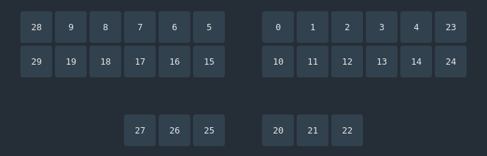

# ZMK files for ObiWanStenobit keyboard

Firmware configuration and keymap definitions for the ObiWanStenobit keyboard powered by [ZMK Firmware](https://zmk.dev/).

## Important Notice

This is the **official and supported branch** of the ObiWanStenobit firmware.  
Only the firmware builds generated from this branch are tested to be **stable and functional**.

> **Always download the firmware from the `main` branch.**  
> Files from other branches are experimental and not recommended for installation.

## Layouts

To maintain simplicity, the default provided layout is the **30-key** configuration.

In the 30-key layout, the far-left column (keys [28] and [29]) is optional. These keys are used to access additional layers and `ZMK Studio`.

> If these two keys are not soldered, ZMK Studio cannot be accessed unless the user configures specific key combinations directly in the firmware. For this reason, building the **30-key layout** is strongly recommended.

## Keymaps

The default firmware provides **four layers**.

To enter `ZMK Studio`, press the keys in the opposite top corners: **[28]** and **[23]**.

